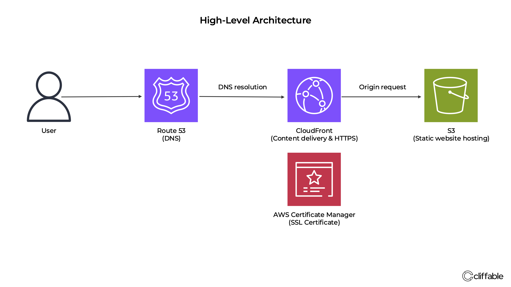

# cliffable.com — Static Site on AWS

## Overview

This project demonstrates how to design and deploy a production-style static website on AWS using fully managed services.

It focuses on simplicity, low cost, and scalability, while applying core cloud architecture principles such as secure access, separation of concerns, and global content delivery.

The implementation prioritises clarity and maintainability, making it suitable as both a personal portfolio and a reference architecture.

---

## Context

This project is my personal portfolio site, built to showcase AWS architecture projects and document real-world systems.

The goal was to create a low-cost, production-style static website architecture using managed AWS services rather than a traditional hosting platform.

---

## Tech Stack

- Amazon S3
- Amazon CloudFront
- Amazon Route 53
- AWS Certificate Manager (ACM)
- HTML / CSS

---

## Architecture Overview

High-level architecture of the system:

User → Route 53 → CloudFront → S3

- **Amazon S3** — stores static website files (HTML, CSS, assets)
- **CloudFront** — CDN for caching, HTTPS, and global delivery
- **Route 53** — DNS routing for cliffable.com
- **ACM (AWS Certificate Manager)** — SSL certificate for HTTPS

---

## Key Decisions

### Use S3 for hosting
- Simple, low-cost static site hosting
- No server management required  

**Trade-off:**  
No server-side logic (purely static)

---

### Use CloudFront in front of S3
- HTTPS support
- Caching for performance
- Secure access via Origin Access Control (OAC)  

**Trade-off:**  
Added complexity vs direct S3 hosting

---

### Use Route 53 for DNS
- Native AWS integration
- Reliable and scalable

---

### Use ACM for SSL
- Free SSL certificates
- Integrated with CloudFront

---

## Challenges

### S3 AccessDenied (403)
Initially encountered permission errors due to incorrect bucket policy.

**Fix:**  
Aligned S3 bucket policy with CloudFront Origin Access Control.

---

### Domain & SSL setup
ACM certificate validation required correct DNS configuration in Route 53.

**Fix:**  
Used DNS validation and ensured the certificate was created in `us-east-1` for CloudFront.

---

### Default root object behaviour
CloudFront does not automatically map `/projects/` to `/projects/index.html`.

**Fix:**  
Implemented a CloudFront Function to rewrite requests.

---

## Cost

This architecture runs at very low cost at current usage levels.

- S3: minimal (very small storage usage)
- CloudFront: within free tier at current traffic levels
- Route 53: ~$0.50/month for hosted zone

Estimated total: **~$0.50–$1/month at low traffic**

---

## Outcome

- Fully serverless static website
- HTTPS enabled
- Globally distributed via CDN
- Low cost and scalable  

**Live site:** https://cliffable.com

---

## Next Steps

- Add more project pages
- Improve deployment automation
- Expand architecture documentation
